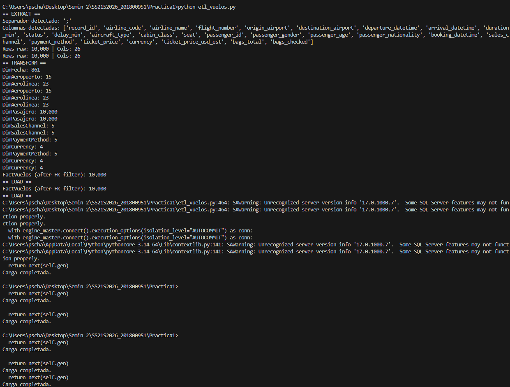
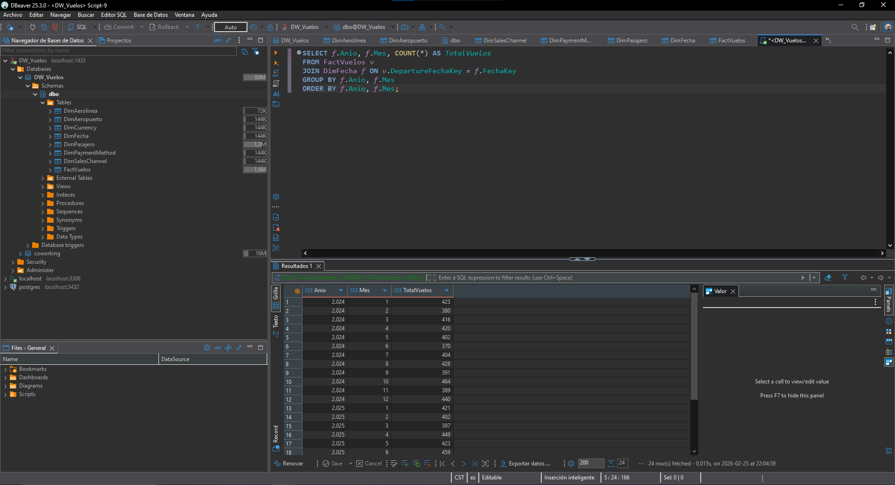
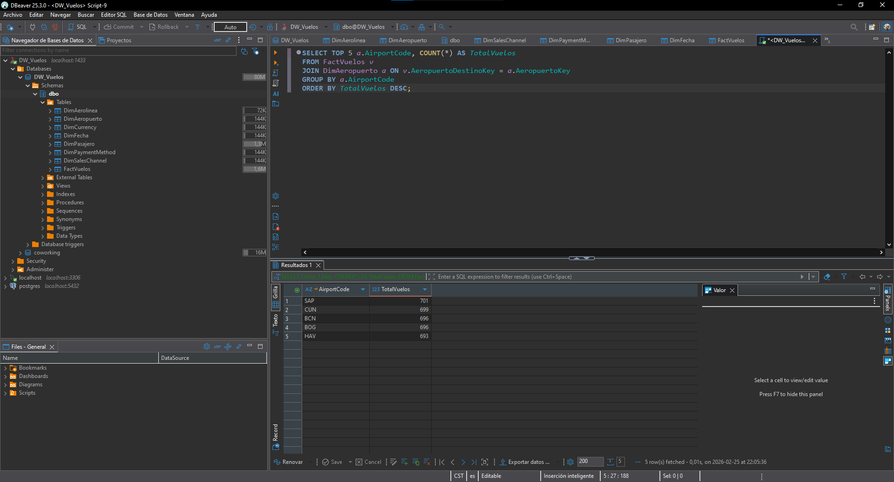
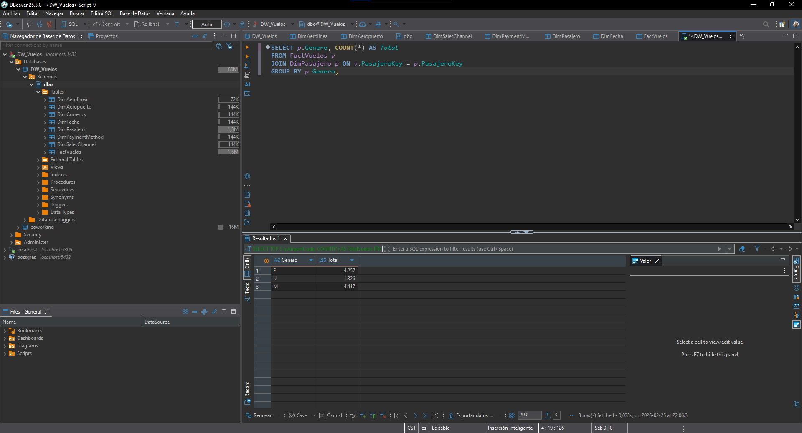

# Práctica 1 – ETL con Python: de dataset crudo a modelo relacional para análisis

## Seminario de Sistemas 2  
Universidad de San Carlos de Guatemala  
Ingeniería en Ciencias y Sistemas

Pablo Gerardo Schaart Calderon

201800951

---

## 1. Descripción del Problema

Las organizaciones generan grandes volúmenes de datos provenientes de múltiples fuentes.  
Para poder analizarlos estratégicamente es necesario aplicar un proceso ETL (Extract, Transform, Load).

En esta práctica se implementó un proceso ETL en Python que toma un dataset crudo de vuelos y lo transforma en un modelo dimensional en SQL Server, permitiendo ejecutar consultas analíticas para la toma de decisiones.

---

## 2. Objetivo

Desarrollar un proceso ETL completo que:

- Extraiga datos desde un archivo CSV crudo.
- Transforme y limpie la información.
- Cargue los datos en un modelo dimensional en SQL Server.
- Permita realizar consultas analíticas para validación y generación de indicadores.

---

## 3. Arquitectura del Proceso ETL

El proceso implementado consta de tres fases principales:

### 3.1 Extract (Extracción)

- Lectura del archivo `dataset_vuelos_crudo.csv`
- Validación de estructura y columnas
- Carga inicial en un DataFrame utilizando Pandas

---

### 3.2 Transform (Transformación)

Se aplicaron las siguientes transformaciones:

- Normalización de nombres de columnas
- Eliminación de espacios innecesarios
- Conversión de fechas con múltiples formatos:
  - `dd/mm/yyyy HH:MM`
  - `mm-dd-yyyy HH:MM AM/PM`
- Estandarización de códigos:
  - Aeropuertos en mayúsculas
  - Aerolíneas en mayúsculas
  - Canales de venta normalizados
- Homologación de género a valores estándar: M, F, O, U
- Conversión de precios:
  - Manejo de coma decimal (ej: 77,60 → 77.60)
- Conversión de campos numéricos
- Creación de rango de edad
- Eliminación de registros inválidos para la tabla de hechos

---

### 3.3 Load (Carga)

El script realiza automáticamente:

- Creación de la base de datos `DW_Vuelos` si no existe
- Creación de todas las tablas del modelo dimensional
- Inserción de dimensiones primero
- Inserción de tabla de hechos después
- Aplicación de claves sustitutas (Surrogate Keys)
- Definición de llaves foráneas

---

## 4. Modelo de Datos

Se implementó un modelo estrella.

### 4.1 Grano

Una fila en la tabla de hechos representa un vuelo individual registrado en el dataset.

---

### 4.2 Tabla de Hechos

**FactVuelos**

Contiene:

- Claves foráneas hacia dimensiones
- Métricas:
  - DurationMin
  - DelayMin
  - TicketPrice
  - TicketPriceUsdEst
  - BagsTotal
  - BagsChecked

---

### 4.3 Dimensiones

- DimFecha
- DimAeropuerto
- DimAerolinea
- DimPasajero
- DimSalesChannel
- DimPaymentMethod
- DimCurrency

Cada dimensión posee una clave sustituta generada en el proceso ETL.

---

## 5. Estructura del Proyecto

```
SS22S2026_201800951/
└── Practica1/
    dataset_vuelos_crudo.csv
    Base.sql
    etl_vuelos.py
    README.md
```

---

## 6. Requisitos Técnicos

- Python 3.10 o superior
- Microsoft SQL Server
- ODBC Driver 17 o 18 para SQL Server
- Librerías Python:
  - pandas
  - sqlalchemy
  - pyodbc

---

## 7. Instalación de Dependencias

Instalar librerías necesarias:

```bash
pip install -r requirements.txt
```

Contenido del archivo `requirements.txt`:

```
pandas
sqlalchemy
pyodbc
```

---

## 8. Ejecución del Proyecto

### Paso 1 – Verificar SQL Server

- Servicio activo
- Permisos de conexión habilitados
- Driver ODBC instalado

### Paso 2 – Verificar ubicación del dataset

El archivo debe estar en:

```
./dataset_vuelos_crudo.csv
```

### Paso 3 – Ejecutar el ETL

```bash
python etl_vuelos.py
```

El script:

- Creará la base de datos automáticamente si no existe
- Creará las tablas
- Insertará los registros transformados



---

## 9. Validación en SQL Server

Verificar:

- Base `DW_Vuelos` creada
- Tablas creadas correctamente
- Registros insertados

Ejemplo de validación:

```sql
SELECT COUNT(*) FROM FactVuelos;
```

---

## 10. Consultas Analíticas

### Vuelos por mes

```sql
SELECT f.Anio, f.Mes, COUNT(*) AS TotalVuelos
FROM FactVuelos v
JOIN DimFecha f ON v.DepartureFechaKey = f.FechaKey
GROUP BY f.Anio, f.Mes
ORDER BY f.Anio, f.Mes;
```



### Top 5 destinos más frecuentes

```sql
SELECT TOP 5 a.AirportCode, COUNT(*) AS TotalVuelos
FROM FactVuelos v
JOIN DimAeropuerto a ON v.AeropuertoDestinoKey = a.AeropuertoKey
GROUP BY a.AirportCode
ORDER BY TotalVuelos DESC;
```



### Distribución por género

```sql
SELECT p.Genero, COUNT(*) AS Total
FROM FactVuelos v
JOIN DimPasajero p ON v.PasajeroKey = p.PasajeroKey
GROUP BY p.Genero;
```


---

## 11. Resultados

- Base creada automáticamente
- Tablas cargadas
- Consultas ejecutadas correctamente

---

## 12. Decisiones Técnicas

- Uso de SQLAlchemy para conexión eficiente.
- Generación de surrogate keys en Python.
- Validaciones para evitar duplicados.
- Conversión robusta de fechas con múltiples formatos.
- Normalización de datos inconsistentes.
- Implementación de modelo estrella para análisis multidimensional.

---

## 13. Conclusión

Se implementó exitosamente un proceso ETL completo que transforma datos crudos en un modelo estructurado para análisis, cumpliendo los requerimientos técnicos y académicos establecidos en la práctica.