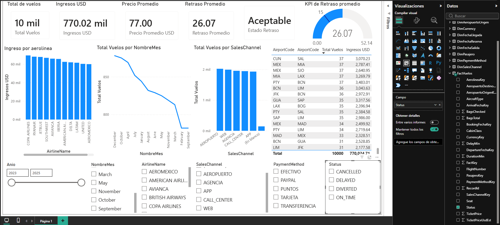
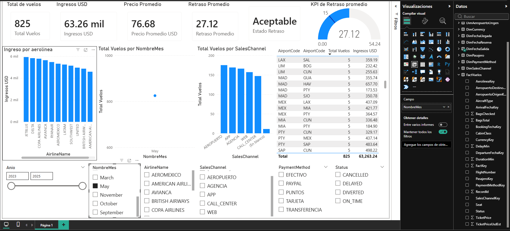
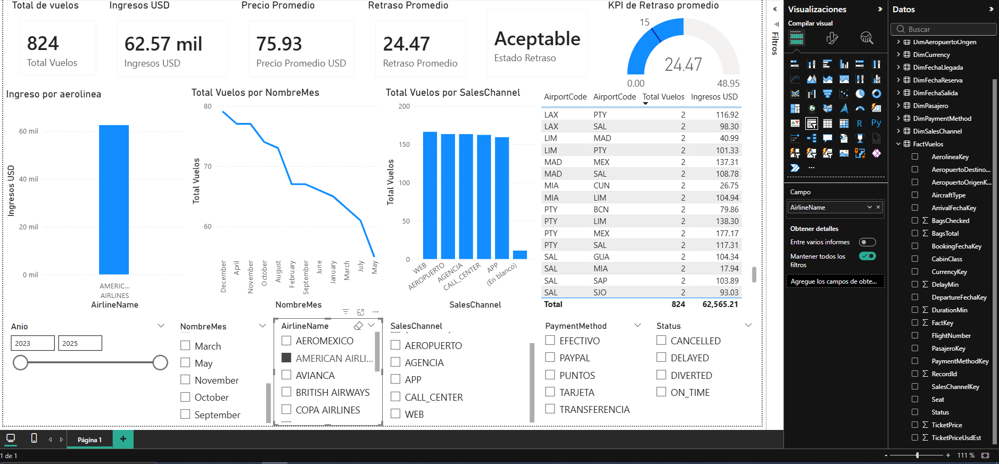

# Práctica 2 – Diseño de Dashboard y KPIs con Power BI

## Curso
Seminario de Sistemas 2  
Ingeniería en Ciencias y Sistemas  
Universidad de San Carlos de Guatemala  

## Estudiante
Pablo Gerardo Schaart Calderon  
201800951

---

## 1. Introducción

En la presente práctica se desarrolló un dashboard interactivo en Power BI utilizando como fuente de datos el Data Warehouse **DW_Vuelos**, diseñado previamente en la Práctica 1.  

El objetivo principal fue transformar los datos transaccionales de vuelos en información estratégica mediante técnicas de modelado tabular, creación de medidas DAX y visualización de indicadores clave de desempeño (KPIs), con el fin de apoyar la toma de decisiones operativas y comerciales.

---

## 2. Fuente de datos

Se utilizó una base de datos relacional implementada en **SQL Server**, con un modelo dimensional tipo **esquema estrella**, compuesta por:

### Tabla de hechos
- FactVuelos

### Tablas de dimensiones
- DimFecha
- DimAeropuerto
- DimAerolinea
- DimPasajero
- DimSalesChannel
- DimPaymentMethod
- DimCurrency

Para facilitar el análisis temporal y de rutas, en Power BI se implementaron **dimensiones de rol**, creando:

- DimFechaSalida  
- DimFechaLlegada  
- DimFechaReserva  
- DimAeropuertoOrigen  
- DimAeropuertoDestino  

Esto permitió evitar ambigüedad en las relaciones y mejorar la calidad del modelo analítico.

---

## 3. Modelo de datos

El modelo implementado corresponde a un **modelo estrella**, donde la tabla FactVuelos contiene las métricas principales del negocio, tales como:

- Precio del boleto  
- Duración del vuelo  
- Minutos de retraso  
- Cantidad de equipaje  
- Estado del vuelo  

Las dimensiones permiten realizar análisis desde distintas perspectivas, tales como:

- Tiempo (año, mes, trimestre, día)  
- Aerolínea  
- Canal de venta  
- Método de pago  
- Origen y destino  

Las relaciones fueron configuradas como **uno a muchos (1:*)**, con dirección de filtro simple desde dimensiones hacia la tabla de hechos.

---

## 4. Medidas DAX implementadas

Se crearon medidas analíticas para evaluar el desempeño operativo y comercial del negocio:

- Total Vuelos  
- Ingresos USD  
- Retraso Promedio  
- Duración Promedio  
- Precio Promedio del Boleto  
- Meta de Retraso  
- Estado del Retraso  
- Indicador de Semáforo  

Estas medidas permiten analizar el volumen de operaciones, eficiencia del servicio y comportamiento financiero.

---

## 5. KPI principal

Se implementó un KPI visual basado en el **retraso promedio de los vuelos**, con una meta operativa establecida en 15 minutos.

Interpretación:

- Óptimo: retraso menor o igual a 15 minutos  
- Aceptable: retraso entre 15 y 30 minutos  
- Crítico: retraso mayor a 30 minutos  

Este indicador permite evaluar rápidamente la eficiencia operacional del servicio aéreo.

---

## 6. Visualizaciones del dashboard

El dashboard incluye múltiples visualizaciones estratégicas:

- Tarjetas KPI:
  - Total de vuelos
  - Ingresos totales
  - Retraso promedio
  - Precio promedio del boleto
  - Estado operativo

- KPI tipo medidor para el retraso promedio

- Gráfico de columnas:
  - Ingresos por aerolínea

- Gráfico de líneas:
  - Tendencia de vuelos por mes

- Gráfico de columnas:
  - Distribución de vuelos por canal de venta

- Tabla analítica:
  - Rutas más frecuentes (origen, destino, total de vuelos e ingresos)

---

## 7. Interactividad del dashboard

Se implementaron segmentadores (filtros visuales) para permitir análisis dinámico por:

- Año  
- Mes  
- Aerolínea  
- Canal de venta  
- Método de pago  
- Estado del vuelo  

Esto permite realizar exploración interactiva de los datos y facilitar la identificación de patrones operativos y comerciales.

---

## 8. Conclusiones

El dashboard desarrollado permite visualizar de forma clara el comportamiento del negocio aéreo, facilitando el monitoreo de indicadores operativos como retrasos, volumen de vuelos y desempeño comercial por aerolínea y canal de venta.

El uso de Power BI, junto con un modelo dimensional correctamente estructurado, permite transformar datos en información útil para la toma de decisiones estratégicas dentro de un entorno de inteligencia empresarial.

---

## 9. Capturas

