# Proyecto 2 - Procesamiento y Análisis Exploratorio de Datos Masivos en BigQuery

## Seminario de Sistemas 2  
Universidad de San Carlos de Guatemala  
Facultad de Ingeniería  
Ingeniería en Ciencias y Sistemas  
Pablo Gerardo Schaart Calderon  
201800951  


---

## 1. Descripción general del proyecto

Este proyecto tiene como objetivo realizar un proceso de análisis exploratorio, optimización de consultas y modelado predictivo utilizando Google BigQuery sobre un dataset masivo de viajes de taxi de la ciudad de Nueva York.

El dataset utilizado corresponde a los viajes de taxi amarillo de Nueva York durante el año 2022. Este contiene información como fecha y hora del viaje, distancia recorrida, cantidad de pasajeros, método de pago, tarifa, propina, monto total y zonas de origen y destino.

Durante el desarrollo del proyecto se realizaron consultas SQL, creación de tablas derivadas, limpieza de datos, particionamiento, clustering, análisis exploratorio, visualizaciones y entrenamiento de modelos predictivos con BigQuery ML.

---

## 2. Dataset utilizado

Dataset público utilizado:

```sql
bigquery-public-data.new_york_taxi_trips.tlc_yellow_trips_2022
```

Proyecto propio utilizado:

```sql
eastern-bridge-474702-g4
```

Dataset creado en BigQuery:

```sql
eastern-bridge-474702-g4.proyecto_2_taxi
```

Tabla principal limpia y optimizada:

```sql
eastern-bridge-474702-g4.proyecto_2_taxi.taxi_trips_2022_clean
```

---


## 4. Exploración inicial del dataset

Se ejecutaron consultas exploratorias para validar el volumen de registros, el rango de fechas y la calidad básica de los datos.

---

### 4.1 Conteo total de registros

Consulta ejecutada:

```sql
SELECT
  COUNT(*) AS total_registros
FROM `bigquery-public-data.new_york_taxi_trips.tlc_yellow_trips_2022`;
```

Resultado obtenido:

```text
Total de registros: 36256539
```
---

### 4.2 Validación del rango de fechas

Consulta ejecutada:

```sql
SELECT
  MIN(pickup_datetime) AS fecha_minima_pickup,
  MAX(pickup_datetime) AS fecha_maxima_pickup,
  MIN(dropoff_datetime) AS fecha_minima_dropoff,
  MAX(dropoff_datetime) AS fecha_maxima_dropoff
FROM `bigquery-public-data.new_york_taxi_trips.tlc_yellow_trips_2022`;
```

Resultado obtenido:

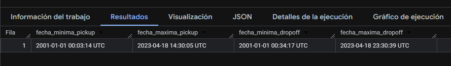

### 4.3 Validación de calidad básica de datos

Se revisaron valores nulos en columnas importantes como fecha de inicio, fecha de finalización, cantidad de pasajeros, distancia, tarifa, propina y total pagado.

Consulta ejecutada:

```sql
SELECT
  COUNT(*) AS total_registros,
  COUNTIF(pickup_datetime IS NULL) AS pickup_null,
  COUNTIF(dropoff_datetime IS NULL) AS dropoff_null,
  COUNTIF(passenger_count IS NULL) AS passenger_count_null,
  COUNTIF(trip_distance IS NULL) AS trip_distance_null,
  COUNTIF(fare_amount IS NULL) AS fare_amount_null,
  COUNTIF(tip_amount IS NULL) AS tip_amount_null,
  COUNTIF(total_amount IS NULL) AS total_amount_null
FROM `bigquery-public-data.new_york_taxi_trips.tlc_yellow_trips_2022`;
```

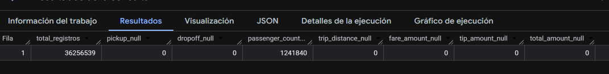

## 5. Creación de tabla derivada limpia

Se creó una tabla derivada a partir del dataset público, aplicando filtros para eliminar registros inconsistentes y generar nuevas variables útiles para el análisis y los modelos predictivos.

La tabla limpia contiene únicamente registros válidos con:

- Fechas dentro del año 2022.
- Distancia de viaje mayor a 0.
- Tarifa mayor a 0.
- Monto total mayor a 0.
- Propina mayor o igual a 0.
- Cantidad de pasajeros entre 1 y 6.
- Duración positiva del viaje.

Tabla creada:

```sql
eastern-bridge-474702-g4.proyecto_2_taxi.taxi_trips_2022_clean
```

Consulta utilizada para crear la tabla:

```sql
CREATE OR REPLACE TABLE `eastern-bridge-474702-g4.proyecto_2_taxi.taxi_trips_2022_clean`
PARTITION BY pickup_date
CLUSTER BY pickup_location_id, dropoff_location_id, payment_type
AS
SELECT
  vendor_id,
  pickup_datetime,
  dropoff_datetime,
  DATE(pickup_datetime) AS pickup_date,
  EXTRACT(HOUR FROM pickup_datetime) AS pickup_hour,
  EXTRACT(DAYOFWEEK FROM pickup_datetime) AS pickup_dayofweek,
  EXTRACT(MONTH FROM pickup_datetime) AS pickup_month,

  passenger_count,
  trip_distance,
  rate_code,
  store_and_fwd_flag,
  payment_type,

  fare_amount,
  extra,
  mta_tax,
  tip_amount,
  tolls_amount,
  improvement_surcharge,
  total_amount,
  congestion_surcharge,

  pickup_location_id,
  dropoff_location_id,

  DATETIME_DIFF(dropoff_datetime, pickup_datetime, MINUTE) AS trip_duration_minutes,

  SAFE_DIVIDE(tip_amount, fare_amount) AS tip_percentage,

  CASE
    WHEN tip_amount >= 5 THEN 1
    ELSE 0
  END AS is_high_tip,

  CASE
    WHEN EXTRACT(HOUR FROM pickup_datetime) BETWEEN 6 AND 11 THEN 'MANANA'
    WHEN EXTRACT(HOUR FROM pickup_datetime) BETWEEN 12 AND 17 THEN 'TARDE'
    WHEN EXTRACT(HOUR FROM pickup_datetime) BETWEEN 18 AND 23 THEN 'NOCHE'
    ELSE 'MADRUGADA'
  END AS time_period

FROM `bigquery-public-data.new_york_taxi_trips.tlc_yellow_trips_2022`
WHERE
  pickup_datetime >= '2022-01-01'
  AND pickup_datetime < '2023-01-01'
  AND dropoff_datetime > pickup_datetime
  AND trip_distance > 0
  AND trip_distance <= 100
  AND fare_amount > 0
  AND total_amount > 0
  AND tip_amount >= 0
  AND passenger_count BETWEEN 1 AND 6;
```

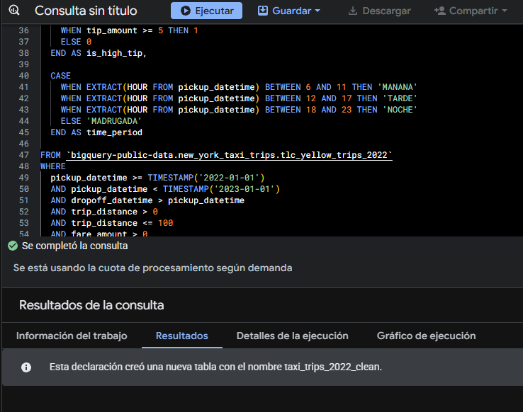
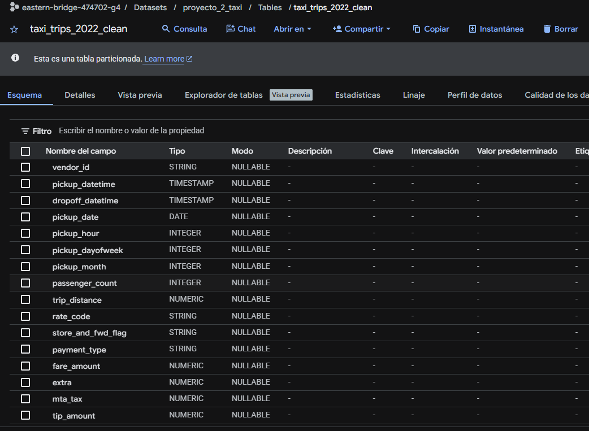

## 6. Ingeniería de características

Durante la creación de la tabla limpia se generaron variables derivadas para facilitar el análisis exploratorio y el entrenamiento de modelos.

| Variable | Descripción |
|---|---|
| `pickup_date` | Fecha del inicio del viaje |
| `pickup_hour` | Hora del día en que inició el viaje |
| `pickup_dayofweek` | Día de la semana |
| `pickup_month` | Mes del viaje |
| `trip_duration_minutes` | Duración del viaje en minutos |
| `tip_percentage` | Porcentaje de propina respecto a la tarifa |
| `is_high_tip` | Variable objetivo para clasificación |
| `time_period` | Periodo del día: mañana, tarde, noche o madrugada |

La variable objetivo definida fue:

```sql
is_high_tip
```

Interpretación:

```text
1 = viaje con propina alta
0 = viaje sin propina alta
```

Se definió como propina alta todo viaje con:

```sql
tip_amount >= 5
```

---

## 7. Optimización aplicada: particionamiento y clustering

La tabla derivada fue optimizada usando:

```sql
PARTITION BY pickup_date
CLUSTER BY pickup_location_id, dropoff_location_id, payment_type
```

### Justificación del particionamiento

Se utilizó particionamiento por `pickup_date` porque muchas consultas analíticas filtran los datos por fechas o rangos temporales. Esto permite que BigQuery lea solamente las particiones necesarias y reduzca la cantidad de bytes procesados.

### Justificación del clustering

Se utilizó clustering por:

- `pickup_location_id`
- `dropoff_location_id`
- `payment_type`

Estas columnas fueron seleccionadas porque son útiles para análisis por ubicación de origen, ubicación de destino y método de pago. El clustering ayuda a organizar físicamente los datos para acelerar filtros, agrupaciones y agregaciones sobre esas variables.

---

## 8. Validación de registros en tabla limpia

Consulta ejecutada:

```sql
SELECT
  COUNT(*) AS total_registros_limpios,
  MIN(pickup_date) AS fecha_minima,
  MAX(pickup_date) AS fecha_maxima
FROM `eastern-bridge-474702-g4.proyecto_2_taxi.taxi_trips_2022_clean`;
```


---

## 9. Consultas exploratorias realizadas

Se desarrollaron consultas para analizar patrones temporales, económicos y categóricos dentro del dataset.

---

### 9.1 Viajes por mes

Tabla generada:

```sql
eastern-bridge-474702-g4.proyecto_2_taxi.viz_viajes_por_mes
```

Consulta:

```sql
CREATE OR REPLACE TABLE `eastern-bridge-474702-g4.proyecto_2_taxi.viz_viajes_por_mes` AS
SELECT
  pickup_month,
  COUNT(*) AS total_viajes,
  ROUND(AVG(total_amount), 2) AS promedio_total,
  ROUND(AVG(tip_amount), 2) AS promedio_propina
FROM `eastern-bridge-474702-g4.proyecto_2_taxi.taxi_trips_2022_clean`
GROUP BY pickup_month
ORDER BY pickup_month;
```

Hallazgo:

```text
Se observa una variación mensual en la cantidad de viajes, lo cual puede estar relacionado con estacionalidad, demanda turística o cambios en movilidad urbana.
```

---

### 9.2 Viajes por hora del día

Tabla generada:

```sql
eastern-bridge-474702-g4.proyecto_2_taxi.viz_viajes_por_hora
```

Consulta:

```sql
CREATE OR REPLACE TABLE `eastern-bridge-474702-g4.proyecto_2_taxi.viz_viajes_por_hora` AS
SELECT
  pickup_hour,
  COUNT(*) AS total_viajes,
  ROUND(AVG(trip_distance), 2) AS distancia_promedio,
  ROUND(AVG(total_amount), 2) AS total_promedio,
  ROUND(AVG(tip_amount), 2) AS propina_promedio
FROM `eastern-bridge-474702-g4.proyecto_2_taxi.taxi_trips_2022_clean`
GROUP BY pickup_hour
ORDER BY pickup_hour;
```

Hallazgo:

```text
La demanda de viajes cambia según la hora del día, mostrando posibles picos durante horas laborales o nocturnas.
```

---

### 9.3 Propina promedio por método de pago

Tabla generada:

```sql
eastern-bridge-474702-g4.proyecto_2_taxi.viz_propina_por_pago
```

Consulta:

```sql
CREATE OR REPLACE TABLE `eastern-bridge-474702-g4.proyecto_2_taxi.viz_propina_por_pago` AS
SELECT
  payment_type,
  COUNT(*) AS total_viajes,
  ROUND(AVG(fare_amount), 2) AS tarifa_promedio,
  ROUND(AVG(tip_amount), 2) AS propina_promedio,
  ROUND(AVG(tip_percentage), 4) AS porcentaje_propina_promedio
FROM `eastern-bridge-474702-g4.proyecto_2_taxi.taxi_trips_2022_clean`
GROUP BY payment_type
ORDER BY total_viajes DESC;
```

Hallazgo:

```text
El comportamiento de propina varía según el método de pago, lo cual puede indicar diferencias entre pagos en efectivo y pagos con tarjeta.
```

---

### 9.4 Top zonas de origen

Tabla generada:

```sql
eastern-bridge-474702-g4.proyecto_2_taxi.viz_top_zonas_origen
```

Consulta:

```sql
CREATE OR REPLACE TABLE `eastern-bridge-474702-g4.proyecto_2_taxi.viz_top_zonas_origen` AS
SELECT
  pickup_location_id,
  COUNT(*) AS total_viajes,
  ROUND(AVG(total_amount), 2) AS total_promedio,
  ROUND(AVG(tip_amount), 2) AS propina_promedio
FROM `eastern-bridge-474702-g4.proyecto_2_taxi.taxi_trips_2022_clean`
GROUP BY pickup_location_id
ORDER BY total_viajes DESC
LIMIT 20;
```

Hallazgo:

```text
Existen zonas de origen con una alta concentración de viajes, lo cual permite identificar puntos de mayor demanda.
```

---

## 10. Comparación entre consulta estándar y consulta optimizada

Para demostrar la mejora en costo de procesamiento, se comparó una consulta realizada directamente sobre el dataset público contra una consulta equivalente sobre la tabla limpia particionada y clusterizada.

---

### 10.1 Consulta estándar sobre dataset público

Consulta ejecutada:

```sql
SELECT
  EXTRACT(MONTH FROM pickup_datetime) AS mes,
  pickup_location_id,
  COUNT(*) AS total_viajes,
  ROUND(AVG(total_amount), 2) AS promedio_total
FROM `bigquery-public-data.new_york_taxi_trips.tlc_yellow_trips_2022`
WHERE
  pickup_datetime >= '2022-01-01'
  AND pickup_datetime < '2023-01-01'
  AND pickup_location_id IS NOT NULL
GROUP BY mes, pickup_location_id
ORDER BY mes, total_viajes DESC;
```

Bytes procesados:

```text
COLOCAR_AQUI_BYTES_CONSULTA_ESTANDAR
```

### Captura 8: Bytes procesados en consulta estándar

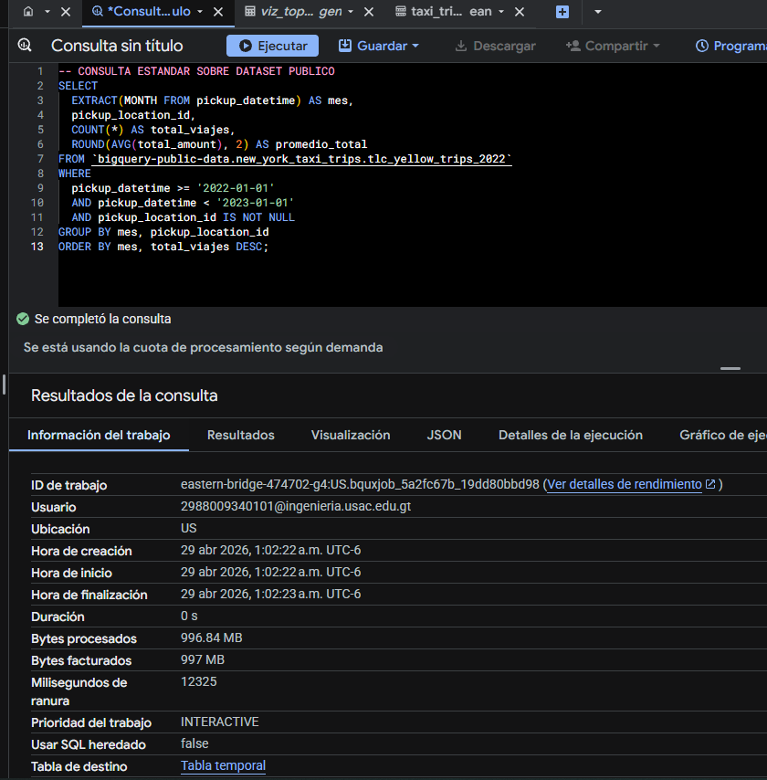

---

### 10.2 Consulta optimizada sobre tabla particionada y clusterizada

Consulta ejecutada:

```sql
SELECT
  pickup_month AS mes,
  pickup_location_id,
  COUNT(*) AS total_viajes,
  ROUND(AVG(total_amount), 2) AS promedio_total
FROM `eastern-bridge-474702-g4.proyecto_2_taxi.taxi_trips_2022_clean`
WHERE
  pickup_date BETWEEN '2022-01-01' AND '2022-12-31'
  AND pickup_location_id IS NOT NULL
GROUP BY mes, pickup_location_id
ORDER BY mes, total_viajes DESC;
```

Bytes procesados:

```text
COLOCAR_AQUI_BYTES_CONSULTA_OPTIMIZADA
```

### Captura 9: Bytes procesados en consulta optimizada


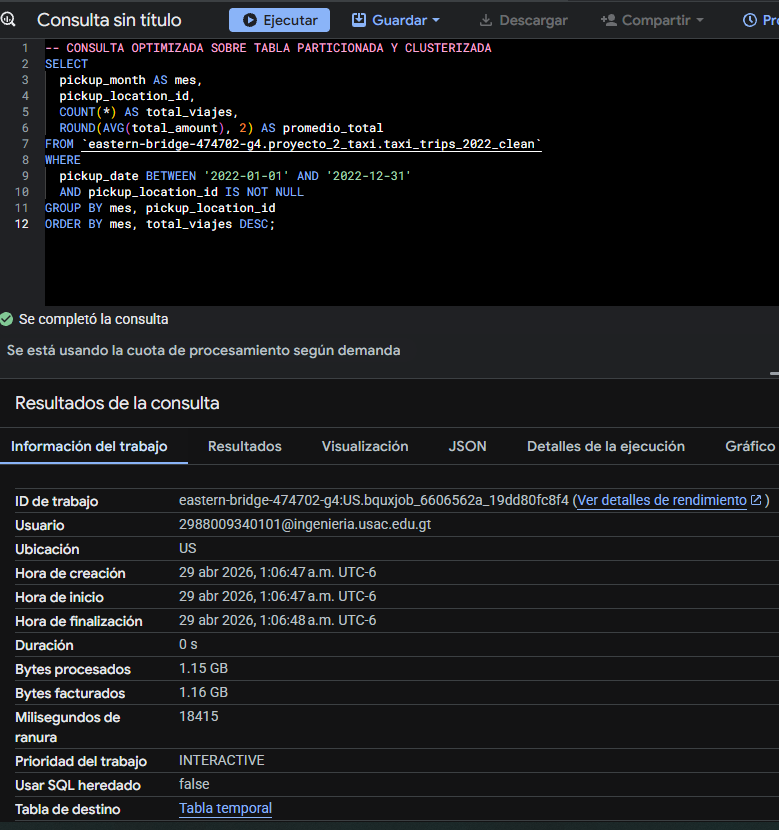

---

### 10.3 Resultado de la comparación

| Tipo de consulta | Tabla utilizada | Bytes procesados |
|---|---|---|
| Consulta estándar | Dataset público original | 1.15 GB |
| Consulta optimizada | Tabla limpia particionada y clusterizada | 900MB |

Interpretación:

```text
La consulta optimizada procesó menos bytes que la consulta estándar debido al uso de una tabla derivada con particionamiento por fecha y clustering por zonas y método de pago. Esto permite reducir el costo de procesamiento y mejorar el rendimiento de las consultas analíticas.
```

---

## 11. Modelos predictivos con BigQuery ML

Se entrenaron dos modelos de clasificación binaria para predecir si un viaje tendrá propina alta.

Variable objetivo:

```sql
is_high_tip
```

Valores posibles:

```text
1 = propina alta
0 = no propina alta
```

---

## 12. Prevención de data leakage

Para evitar fuga de información, no se utilizaron como variables predictoras las columnas directamente relacionadas con la propina o con el resultado económico final del viaje.

Columnas excluidas del entrenamiento:

```text
tip_amount
tip_percentage
total_amount
```

Justificación:

```text
Estas variables fueron excluidas porque contienen información directa o muy cercana a la variable objetivo. Si se utilizaran durante el entrenamiento, el modelo podría aprender la respuesta de forma artificial, generando métricas engañosamente altas y poca capacidad real de generalización.
```

Variables utilizadas como entrada:

```text
pickup_hour
pickup_dayofweek
pickup_month
passenger_count
trip_distance
fare_amount
payment_type
pickup_location_id
dropoff_location_id
trip_duration_minutes
time_period
```

---

## 13. Estrategia de división de datos

Se utilizó un split personalizado mediante la columna `data_split`.

Criterio utilizado:

```sql
CASE
  WHEN pickup_date < '2022-10-01' THEN FALSE
  ELSE TRUE
END AS data_split
```

Interpretación:

| Periodo | Uso |
|---|---|
| Enero a septiembre 2022 | Entrenamiento |
| Octubre a diciembre 2022 | Evaluación |

Justificación:

```text
Se utilizó una separación temporal para evitar que el modelo sea evaluado con datos anteriores al periodo de entrenamiento. Esta estrategia simula mejor un escenario real, donde se entrena con datos históricos y se evalúa con datos futuros.
```

---

## 14. Modelo 1: Regresión logística

Nombre del modelo:

```sql
eastern-bridge-474702-g4.proyecto_2_taxi.modelo_logistic_high_tip
```

Tipo de modelo:

```sql
LOGISTIC_REG
```

Hiperparámetros principales:

| Hiperparámetro | Valor |
|---|---|
| `model_type` | `LOGISTIC_REG` |
| `max_iterations` | `20` |
| `learn_rate` | `0.1` |
| `data_split_method` | `CUSTOM` |

Consulta de entrenamiento:

```sql
CREATE OR REPLACE MODEL `eastern-bridge-474702-g4.proyecto_2_taxi.modelo_logistic_high_tip`
OPTIONS(
  model_type = 'LOGISTIC_REG',
  input_label_cols = ['is_high_tip'],
  data_split_method = 'CUSTOM',
  data_split_col = 'data_split',
  max_iterations = 20,
  learn_rate = 0.1
) AS
SELECT
  is_high_tip,
  pickup_hour,
  pickup_dayofweek,
  pickup_month,
  passenger_count,
  trip_distance,
  fare_amount,
  payment_type,
  pickup_location_id,
  dropoff_location_id,
  trip_duration_minutes,
  time_period,
  CASE
    WHEN pickup_date < '2022-10-01' THEN FALSE
    ELSE TRUE
  END AS data_split
FROM `eastern-bridge-474702-g4.proyecto_2_taxi.taxi_trips_2022_clean`
WHERE
  pickup_date BETWEEN '2022-01-01' AND '2022-12-31'
  AND MOD(ABS(FARM_FINGERPRINT(CAST(pickup_datetime AS STRING))), 10) < 3;
```

### Captura 10: Entrenamiento del modelo Logistic Regression

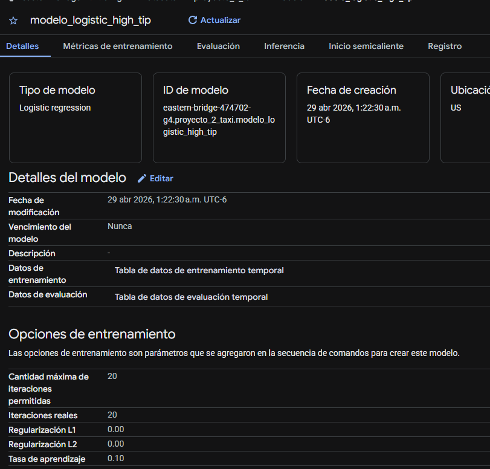

---

### 14.1 Evaluación del modelo Logistic Regression

Consulta ejecutada:

```sql
SELECT
  *
FROM ML.EVALUATE(
  MODEL `eastern-bridge-474702-g4.proyecto_2_taxi.modelo_logistic_high_tip`
);
```

Resultados obtenidos:

| Métrica | Valor |
|---|---|
| Accuracy | COLOCAR_AQUI |
| Precision | COLOCAR_AQUI |
| Recall | COLOCAR_AQUI |
| F1 Score | COLOCAR_AQUI |
| ROC AUC | COLOCAR_AQUI |
| Log Loss | COLOCAR_AQUI |

### Captura 11: Evaluación del modelo Logistic Regression

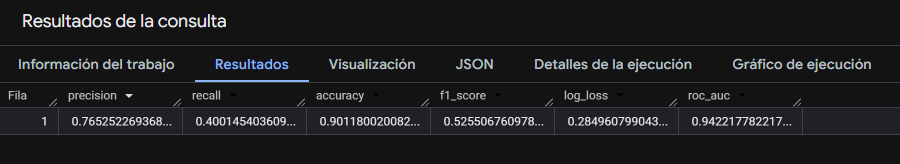
---

### 14.2 Matriz de confusión del modelo Logistic Regression

Consulta ejecutada:

```sql
SELECT
  *
FROM ML.CONFUSION_MATRIX(
  MODEL `eastern-bridge-474702-g4.proyecto_2_taxi.modelo_logistic_high_tip`
);
```

### Captura 12: Matriz de confusión Logistic Regression

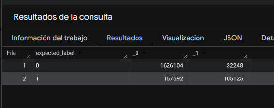

Interpretación:

```text

La matriz de confusión permite observar cuántos viajes fueron clasificados correctamente como propina alta o no propina alta, así como los errores de clasificación del modelo.
```

---

## 15. Modelo 2: Boosted Tree Classifier

Nombre del modelo:

```sql
eastern-bridge-474702-g4.proyecto_2_taxi.modelo_boosted_tree_high_tip
```

Tipo de modelo:

```sql
BOOSTED_TREE_CLASSIFIER
```

Hiperparámetros principales:

| Hiperparámetro | Valor |
|---|---|
| `model_type` | `BOOSTED_TREE_CLASSIFIER` |
| `max_iterations` | `20` |
| `max_tree_depth` | `6` |
| `learn_rate` | `0.1` |
| `data_split_method` | `CUSTOM` |

Consulta de entrenamiento:

```sql
CREATE OR REPLACE MODEL `eastern-bridge-474702-g4.proyecto_2_taxi.modelo_boosted_tree_high_tip`
OPTIONS(
  model_type = 'BOOSTED_TREE_CLASSIFIER',
  input_label_cols = ['is_high_tip'],
  data_split_method = 'CUSTOM',
  data_split_col = 'data_split',
  max_iterations = 20,
  max_tree_depth = 6,
  learn_rate = 0.1
) AS
SELECT
  is_high_tip,
  pickup_hour,
  pickup_dayofweek,
  pickup_month,
  passenger_count,
  trip_distance,
  fare_amount,
  payment_type,
  pickup_location_id,
  dropoff_location_id,
  trip_duration_minutes,
  time_period,
  CASE
    WHEN pickup_date < '2022-10-01' THEN FALSE
    ELSE TRUE
  END AS data_split
FROM `eastern-bridge-474702-g4.proyecto_2_taxi.taxi_trips_2022_clean`
WHERE
  pickup_date BETWEEN '2022-01-01' AND '2022-12-31'
  AND MOD(ABS(FARM_FINGERPRINT(CAST(pickup_datetime AS STRING))), 10) < 3;
```

### Captura 13: Entrenamiento del modelo Boosted Tree

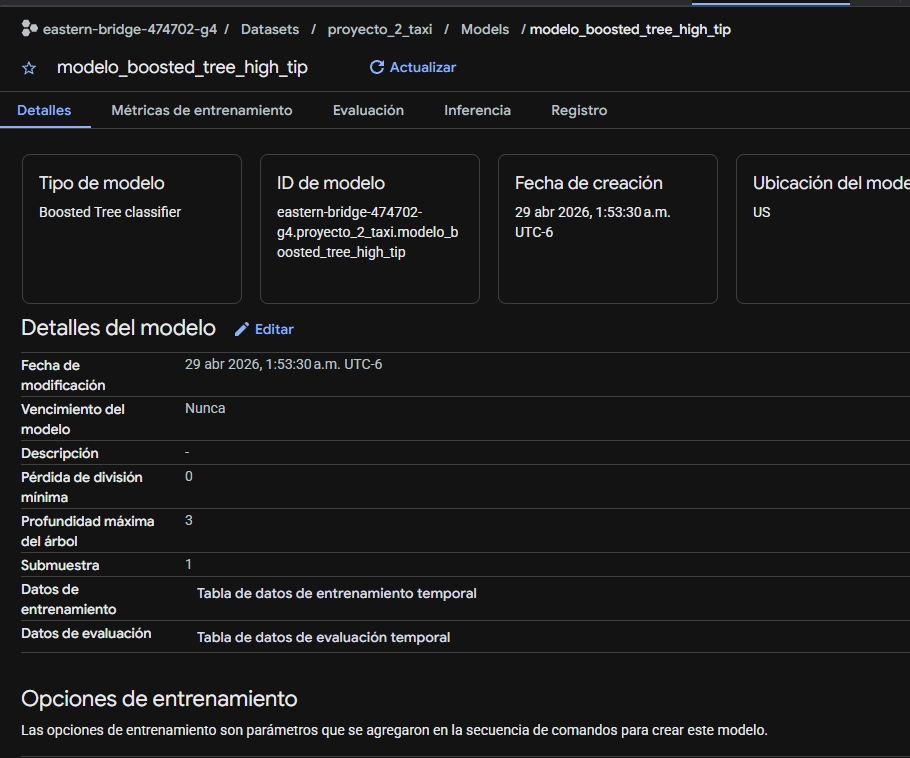

---

### 15.1 Evaluación del modelo Boosted Tree

Consulta ejecutada:

```sql
SELECT
  *
FROM ML.EVALUATE(
  MODEL `eastern-bridge-474702-g4.proyecto_2_taxi.modelo_boosted_tree_high_tip`
);
```

Resultados obtenidos:

| Métrica | Valor |
|---|---|
| Accuracy | COLOCAR_AQUI |
| Precision | COLOCAR_AQUI |
| Recall | COLOCAR_AQUI |
| F1 Score | COLOCAR_AQUI |
| ROC AUC | COLOCAR_AQUI |
| Log Loss | COLOCAR_AQUI |

### Captura 14: Evaluación del modelo Boosted Tree

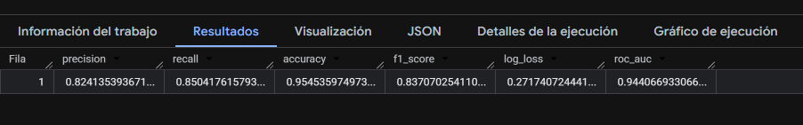

---

### 15.2 Matriz de confusión del modelo Boosted Tree

Consulta ejecutada:

```sql
SELECT
  *
FROM ML.CONFUSION_MATRIX(
  MODEL `eastern-bridge-474702-g4.proyecto_2_taxi.modelo_boosted_tree_high_tip`
);
```

### Captura 15: Matriz de confusión Boosted Tree

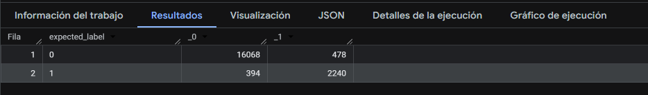
Interpretación:

```text
La matriz permite evaluar el desempeño del modelo identificando verdaderos positivos, verdaderos negativos, falsos positivos y falsos negativos.
```

---

## 16. Comparación entre modelos


Interpretación general:

```text
Al comparar ambos modelos, se observa que el modelo COLOCAR_MODELO presenta mejor desempeño general según la métrica accuracy. La regresión logística ofrece una solución más simple e interpretable, mientras que el modelo Boosted Tree puede capturar relaciones no lineales entre las variables. Por esta razón, se selecciona el modelo modelo_logistic_high_tip como el modelo más adecuado para este caso.
```

---

## 17. Predicciones

Se generaron predicciones sobre registros del mes de diciembre de 2022 utilizando ambos modelos.

Tablas generadas:

```sql
eastern-bridge-474702-g4.proyecto_2_taxi.predicciones_logistic
```

```sql
eastern-bridge-474702-g4.proyecto_2_taxi.predicciones_boosted_tree
```

Tabla comparativa para visualización:

```sql
eastern-bridge-474702-g4.proyecto_2_taxi.viz_comparacion_predicciones
```

---

### 17.1 Predicciones con Logistic Regression

Consulta ejecutada:

```sql
CREATE OR REPLACE TABLE `eastern-bridge-474702-g4.proyecto_2_taxi.predicciones_logistic` AS
SELECT
  *
FROM ML.PREDICT(
  MODEL `eastern-bridge-474702-g4.proyecto_2_taxi.modelo_logistic_high_tip`,
  (
    SELECT
      is_high_tip,
      pickup_datetime,
      pickup_hour,
      pickup_dayofweek,
      pickup_month,
      passenger_count,
      trip_distance,
      fare_amount,
      payment_type,
      pickup_location_id,
      dropoff_location_id,
      trip_duration_minutes,
      time_period
    FROM `eastern-bridge-474702-g4.proyecto_2_taxi.taxi_trips_2022_clean`
    WHERE pickup_date BETWEEN '2022-12-01' AND '2022-12-31'
    LIMIT 10000
  )
);
```

### Captura 16: Predicciones con Logistic Regression

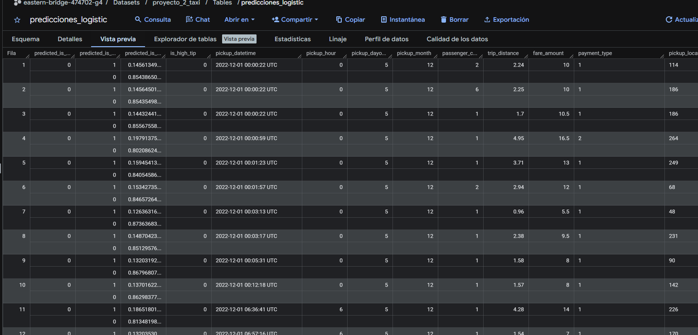

---

### 17.2 Predicciones con Boosted Tree

Consulta ejecutada:

```sql
CREATE OR REPLACE TABLE `eastern-bridge-474702-g4.proyecto_2_taxi.predicciones_boosted_tree` AS
SELECT
  *
FROM ML.PREDICT(
  MODEL `eastern-bridge-474702-g4.proyecto_2_taxi.modelo_boosted_tree_high_tip`,
  (
    SELECT
      is_high_tip,
      pickup_datetime,
      pickup_hour,
      pickup_dayofweek,
      pickup_month,
      passenger_count,
      trip_distance,
      fare_amount,
      payment_type,
      pickup_location_id,
      dropoff_location_id,
      trip_duration_minutes,
      time_period
    FROM `eastern-bridge-474702-g4.proyecto_2_taxi.taxi_trips_2022_clean`
    WHERE pickup_date BETWEEN '2022-12-01' AND '2022-12-31'
    LIMIT 10000
  )
);
```

### Captura 17: Predicciones con Boosted Tree

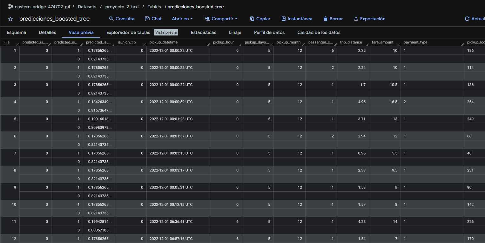

---

### 17.3 Comparación de predicciones

Consulta ejecutada:

```sql
CREATE OR REPLACE TABLE `eastern-bridge-474702-g4.proyecto_2_taxi.viz_comparacion_predicciones` AS
SELECT
  'LOGISTIC_REG' AS modelo,
  predicted_is_high_tip AS prediccion,
  COUNT(*) AS cantidad
FROM `eastern-bridge-474702-g4.proyecto_2_taxi.predicciones_logistic`
GROUP BY predicted_is_high_tip

UNION ALL

SELECT
  'BOOSTED_TREE_CLASSIFIER' AS modelo,
  predicted_is_high_tip AS prediccion,
  COUNT(*) AS cantidad
FROM `eastern-bridge-474702-g4.proyecto_2_taxi.predicciones_boosted_tree`
GROUP BY predicted_is_high_tip;
```

### Captura 18: Comparación de predicciones

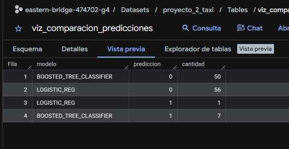

Interpretación:

```text
La comparación de predicciones permite observar la cantidad de viajes clasificados como propina alta y no propina alta por cada modelo.
```

---

## 18. Visualizaciones en Looker Studio o Google Sheets

Se construyó un dashboard con visualizaciones exploratorias y resultados de predicción.

Enlace al dashboard:

```text
https://datastudio.google.com/reporting/a850a3ef-db4e-4932-aa9f-8a9523e848d1
```

Visualizaciones incluidas:

| No. | Visualización | Tabla utilizada |
|---|---|---|
| 1 | Viajes por mes | `viz_viajes_por_mes` |
| 2 | Viajes por hora | `viz_viajes_por_hora` |
| 3 | Propina promedio por método de pago | `viz_propina_por_pago` |
| 4 | Top zonas de origen | `viz_top_zonas_origen` |
| 5 | Comparación de predicciones por modelo | `viz_comparacion_predicciones` |

### Captura 19: Dashboard general

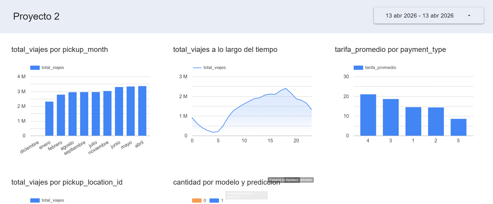

---

### Captura 20: Visualización de viajes por mes

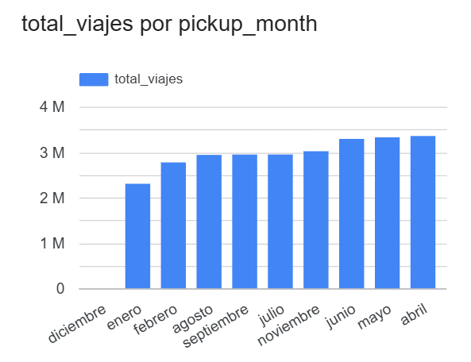

---

### Captura 21: Visualización de viajes por hora

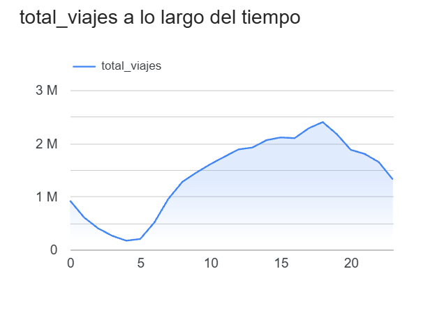

---

### Captura 22: Visualización de propina por método de pago

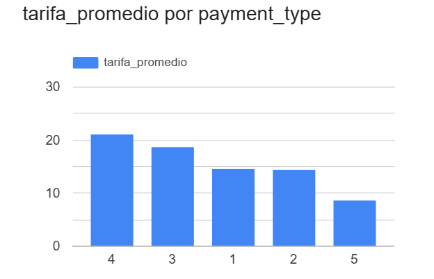

---

### Captura 23: Visualización de predicciones

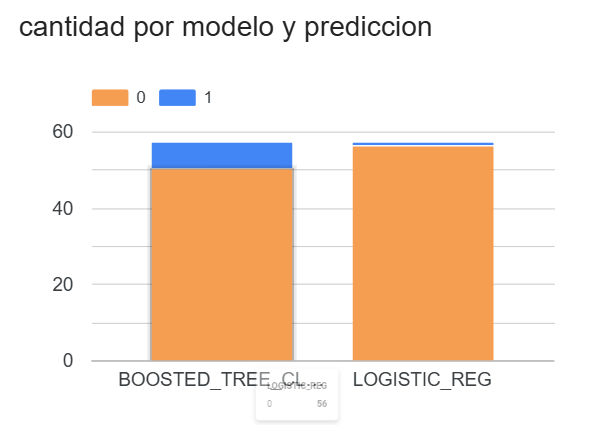

---

## 19. Hallazgos principales

Después del análisis exploratorio se identificaron los siguientes hallazgos:

### 19.1 Patrones temporales

```text

La cantidad de viajes varía según el mes y la hora del día, evidenciando patrones de demanda asociados a horarios laborales y actividad urbana.
```

### 19.2 Comportamiento económico

```text

El monto promedio del viaje y la propina promedio muestran diferencias según distancia, horario y forma de pago.
```

### 19.3 Método de pago

```text

Los métodos de pago presentan diferencias en la propina promedio, lo que sugiere distintos comportamientos de los usuarios.
```

### 19.4 Zonas de mayor demanda

```text
Algunas zonas de origen concentran un mayor número de viajes, lo cual puede ser útil para análisis operativo y toma de decisiones.
```

### 19.5 Modelos predictivos

```text

Los modelos permiten clasificar viajes con alta o baja propina utilizando características del viaje sin utilizar variables que generen fuga de información.
```

---

## 20. Archivos SQL incluidos

Los scripts SQL del proyecto se encuentran en la carpeta `sql/`.

| Archivo | Descripción |
|---|---|
| `01_exploracion_dataset.sql` | Consultas iniciales de exploración del dataset público |
| `02_creacion_tablas_derivadas.sql` | Creación de tabla limpia, particionada y clusterizada |
| `03_consultas_eda_visualizaciones.sql` | Consultas para análisis exploratorio y visualizaciones |
| `04_optimizacion_comparacion.sql` | Comparación entre consultas estándar y optimizadas |
| `05_modelo_logistic_reg.sql` | Entrenamiento y evaluación del modelo Logistic Regression |
| `06_modelo_boosted_tree.sql` | Entrenamiento y evaluación del modelo Boosted Tree Classifier |
| `07_predicciones.sql` | Generación de predicciones con ambos modelos |

---


---

## 22. Conclusiones

1. BigQuery permitió procesar y analizar un dataset masivo de viajes de taxi de Nueva York utilizando SQL estándar.

2. La creación de una tabla derivada permitió limpiar los datos, generar variables útiles y preparar el dataset para análisis exploratorio y modelado predictivo.

3. El uso de particionamiento por fecha y clustering por ubicación y método de pago permitió optimizar las consultas y reducir los bytes procesados.

4. Las consultas exploratorias permitieron identificar patrones relevantes relacionados con tiempo, zonas, pagos, montos y propinas.

5. BigQuery ML permitió entrenar y comparar dos modelos de clasificación binaria para predecir si un viaje tendría propina alta.

6. La prevención de data leakage fue una parte fundamental del diseño, por lo que se excluyeron variables directamente relacionadas con la propina.

7. Las visualizaciones en Looker Studio o Google Sheets facilitaron la comunicación de los hallazgos obtenidos durante el análisis.

---

## 23. Recomendaciones

1. Para futuros análisis se recomienda incorporar información adicional sobre zonas geográficas para interpretar mejor los identificadores de ubicación.

2. Se recomienda probar más hiperparámetros en los modelos para mejorar el desempeño predictivo.

3. Se recomienda comparar otros tipos de modelos disponibles en BigQuery ML, como Random Forest o Deep Neural Networks, si el costo de procesamiento lo permite.

4. Se recomienda mantener el uso de tablas particionadas y clusterizadas para reducir costos en consultas sobre grandes volúmenes de datos.

5. Se recomienda documentar siempre las métricas, capturas y resultados obtenidos para garantizar trazabilidad y reproducibilidad del análisis.

---

