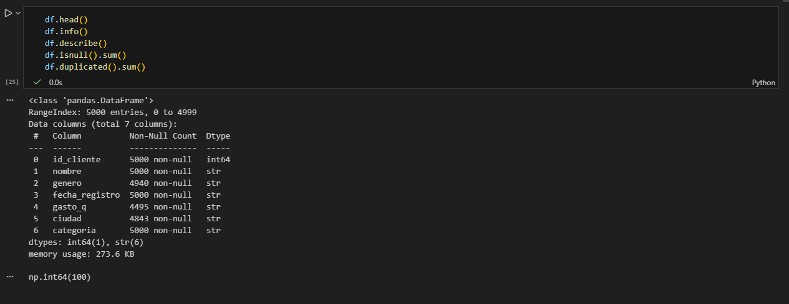
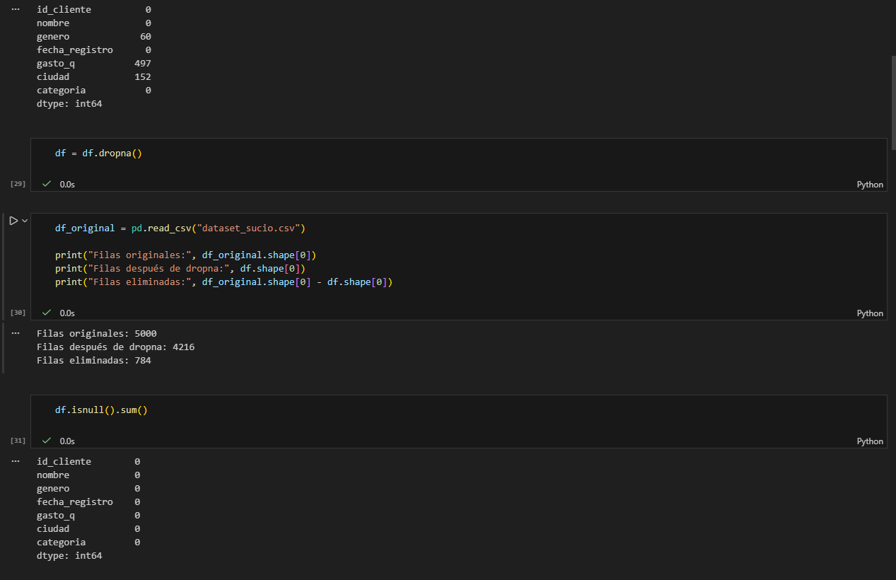
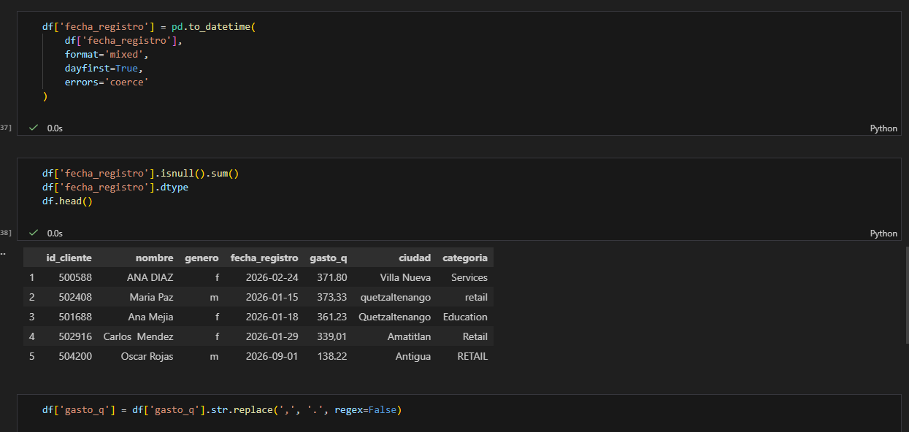
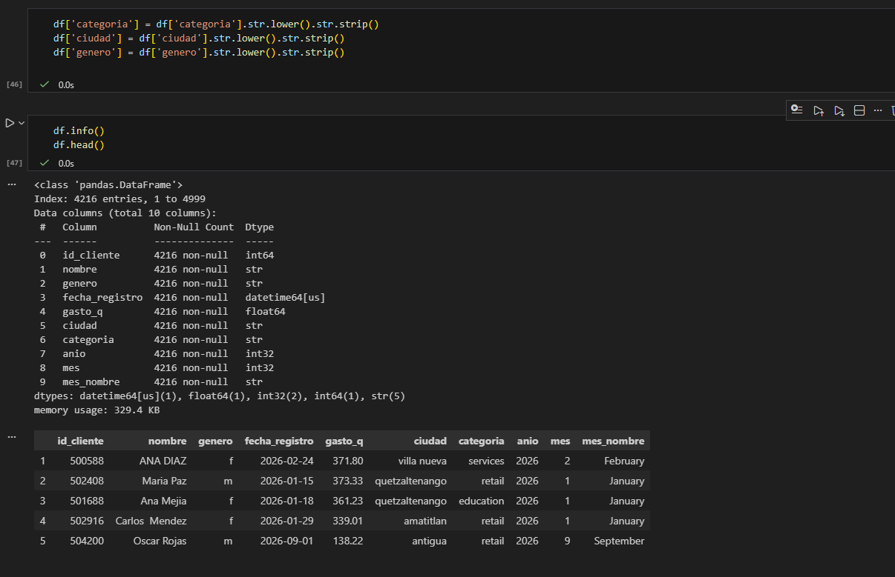

# Tarea 1 – Limpieza y Análisis Inicial de Datos con Python y Pandas

Curso: Seminario de Sistemas 2  
Estudiante: Pablo Gerardo Schaart Calderon  
Carnet: 201800951 

---

## 1. Dataset Utilizado

Nombre del dataset: Dataset de clientes y registros de gasto  
Formato: CSV  

Descripción:  
El dataset contiene información de clientes, incluyendo identificador, nombre, género, fecha de registro, monto de gasto (en quetzales), ciudad y categoría de consumo.

Columnas principales:

- id_cliente  
- nombre  
- genero  
- fecha_registro  
- gasto_q  
- ciudad  
- categoria  

---

## 2. Proceso de Limpieza de Datos

El proceso de preparación y depuración se realizó en varias etapas.

### 2.1 Eliminación de Duplicados

Se verificó la existencia de registros duplicados utilizando:

    df.duplicated().sum()

Posteriormente, se eliminaron con:

    df = df.drop_duplicates()

Esto aseguró que cada registro representara una entrada única.

---

### 2.2 Tratamiento de Valores Faltantes

Se identificaron valores nulos mediante:

    df.isnull().sum()

Se decidió aplicar la eliminación completa de filas con valores faltantes:

    df = df.dropna()

Como resultado, el dataset se redujo en 15.68% de los registros, garantizando consistencia total en las variables utilizadas para el análisis.

---

### 2.3 Estandarización de Formatos

#### Conversión de Fechas

La columna fecha_registro presentaba formatos mixtos (dd/mm/yyyy y yyyy-mm-dd).  
Se estandarizó utilizando:

    df['fecha_registro'] = pd.to_datetime(
        df['fecha_registro'],
        format='mixed',
        dayfirst=True
    )

Esto permitió habilitar análisis temporal por año y mes.

---

#### Conversión de Monto de Gasto

La columna gasto_q contenía valores con coma y punto decimal.  
Se normalizó reemplazando comas por puntos y convirtiendo a tipo numérico:

    df['gasto_q'] = df['gasto_q'].str.replace(',', '.', regex=False)
    df['gasto_q'] = pd.to_numeric(df['gasto_q'])

El tipo final quedó como float64.

---

#### Normalización de Texto

Se estandarizaron columnas categóricas para evitar inconsistencias:

    df['categoria'] = df['categoria'].str.lower().str.strip()
    df['ciudad'] = df['ciudad'].str.lower().str.strip()
    df['genero'] = df['genero'].str.lower().str.strip()

Esto eliminó diferencias en mayúsculas, minúsculas y espacios innecesarios.

---

### 2.4 Creación de Variables Derivadas

Se generaron nuevas columnas para análisis temporal:

    df['anio'] = df['fecha_registro'].dt.year
    df['mes'] = df['fecha_registro'].dt.month
    df['mes_nombre'] = df['fecha_registro'].dt.month_name()

---

## 3. Exploración de Datos

Se realizó un análisis exploratorio utilizando estadísticas descriptivas y visualizaciones.

### 3.1 Estadísticas Descriptivas

Se utilizaron funciones como:

    df.describe()
    df.info()

Esto permitió analizar:

- Distribución del gasto
- Tipos de datos
- Cantidad de registros válidos
- Estructura general del dataset

---

### 3.2 Análisis por Categoría

Se analizaron diferencias en el gasto según categoría y ciudad utilizando agrupaciones simples como:

    df.groupby('categoria')['gasto_q'].mean()
    df.groupby('ciudad')['gasto_q'].mean()

Esto permitió identificar variaciones en el comportamiento de consumo.

---

### 3.3 Visualización

Se generaron gráficos para analizar la distribución del gasto por categoría, permitiendo observar:

- Dispersión de valores  
- Posibles valores atípicos  
- Diferencias entre segmentos  

Las visualizaciones ayudaron a comprender el comportamiento general del gasto y su variabilidad.

---

## 4. Resultados Principales

- Se eliminaron registros incompletos para asegurar calidad de datos.
- Se corrigieron formatos inconsistentes en fechas y montos.
- Se normalizaron variables categóricas.
- Se estandarizó la estructura temporal del dataset.
- Se identificaron diferencias en el gasto promedio entre categorías y ciudades.
- Se observó variabilidad en los montos de gasto según el período del año.

---

## 5. Archivos Entregados

Dentro de la carpeta Tarea1:

- Tarea1.ipynb  
- dataset_sucio.csv  
- README.md  

---

## 6. Conclusión

El proceso de limpieza permitió transformar un dataset con inconsistencias en un conjunto de datos estructurado y confiable para análisis.  
La estandarización de formatos, eliminación de registros incompletos y normalización de variables mejoraron la calidad de la información, permitiendo realizar un análisis exploratorio consistente y fundamentado.
