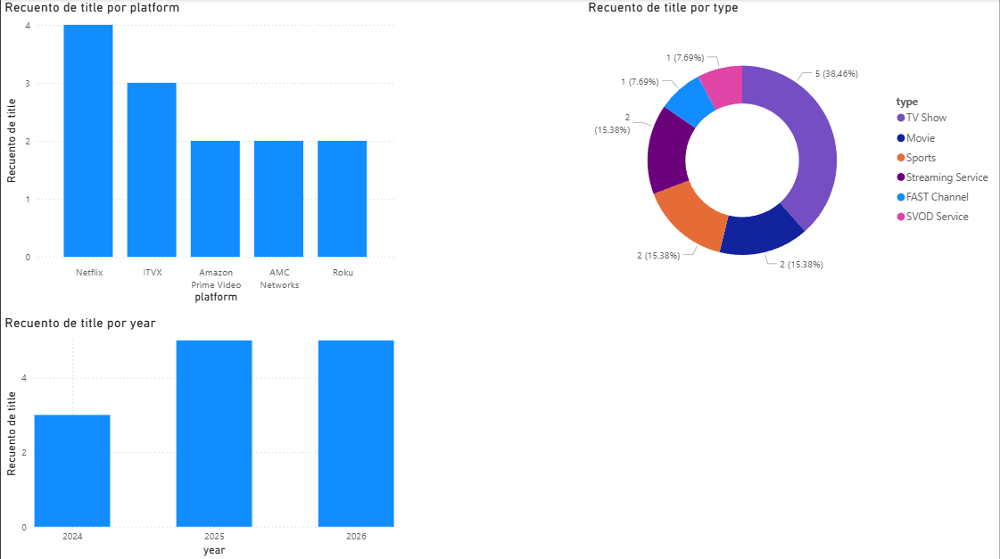
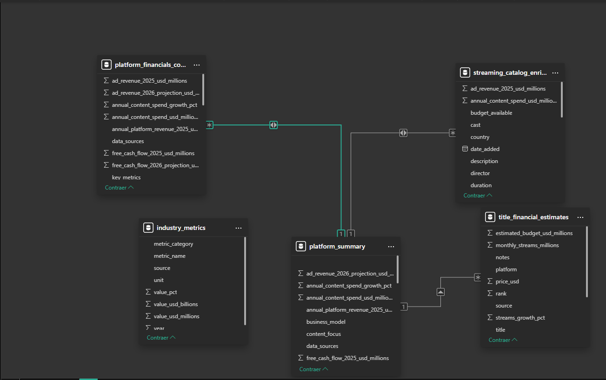

# Tarea 2 - Construcción de dashboard analítico en Power BI

**Curso:** Seminario de Sistemas 2  
**Universidad:** Universidad de San Carlos de Guatemala  
**Estudiante:** Pablo Gerardo Schaart Calderon  
**Carné:** 201800951  

---

## Descripción del trabajo

En esta tarea se realizó la importación y análisis de un dataset relacionado con plataformas de streaming y títulos de contenido digital utilizando **Power BI Desktop**. El objetivo fue construir un dashboard analítico con visualizaciones claras que permitieran interpretar la información de forma visual y apoyar la toma de decisiones.

Para el desarrollo del dashboard se cargaron varios archivos CSV del dataset. Sin embargo, la construcción principal del análisis visual se enfocó en la tabla **`title_financial_estimates`**, ya que permitía trabajar de forma más estable y clara con los campos necesarios para cumplir con la actividad.

---

## Dataset utilizado

El dataset contiene información relacionada con plataformas de streaming, títulos, tipo de contenido y variables asociadas al comportamiento de los títulos dentro de diferentes servicios.

Archivos importados:

- `industry_metrics.csv`
- `platform_financials_comprehensive.csv`
- `platform_summary.csv`
- `streaming_catalog_enriched.csv`
- `title_financial_estimates.csv`

Para el dashboard final se utilizaron principalmente campos de la tabla:

- `title`
- `platform`
- `type`
- `year`

---

## Transformaciones realizadas

Durante la preparación de los datos en Power BI se realizaron las siguientes acciones:

- Importación de los archivos CSV a Power BI Desktop.
- Revisión general de columnas y estructura de cada tabla.
- Selección de la tabla más adecuada para construir el dashboard sin errores de conversión.
- Uso de campos categóricos para construir visualizaciones simples y claras.
- Configuración de recuentos sobre los títulos para comparar plataformas, tipos de contenido y distribución por año.
- Organización visual del dashboard para facilitar la interpretación.

No se realizaron transformaciones complejas debido a que algunos campos numéricos presentaban inconsistencias de tipo de dato. Por esta razón se optó por un dashboard funcional basado en análisis descriptivo utilizando recuentos.

---

## Dashboard desarrollado

El dashboard se construyó con visualizaciones sencillas y útiles para analizar el contenido disponible en el dataset.

### Visualizaciones incluidas

1. **Títulos por plataforma**  
   Gráfico de barras que muestra la cantidad de títulos asociados a cada plataforma.

2. **Títulos por tipo**  
   Gráfico de dona para comparar la distribución del contenido según su tipo, por ejemplo películas o series.

3. **Títulos por año**  
   Gráfico de columnas que permite observar cómo se distribuyen los títulos según el año.

4. **Filtro por plataforma**  
   Segmentador que permite filtrar las visualizaciones y analizar una plataforma específica.

5. **Tarjeta de total de títulos**  
   Indicador general con el total de títulos presentes en el análisis.

---

## Interpretación de resultados

A partir del dashboard se pueden obtener las siguientes observaciones:

- Existen plataformas con una mayor cantidad de títulos registrados dentro del dataset, lo cual sugiere una presencia más amplia de contenido.
- La distribución por tipo permite identificar cuál categoría de contenido tiene mayor representación.
- El análisis por año ayuda a visualizar la concentración de títulos en determinados periodos.
- El uso del filtro por plataforma facilita comparar el comportamiento del contenido de manera individual.

En general, el dashboard permite resumir de manera visual la composición del dataset y presentar resultados de forma clara y comprensible.

---

## Capturas del dashboard

### Captura 1 - Vista general del dashboard

### Captura 2 - Vista del modelo o tablas

---
